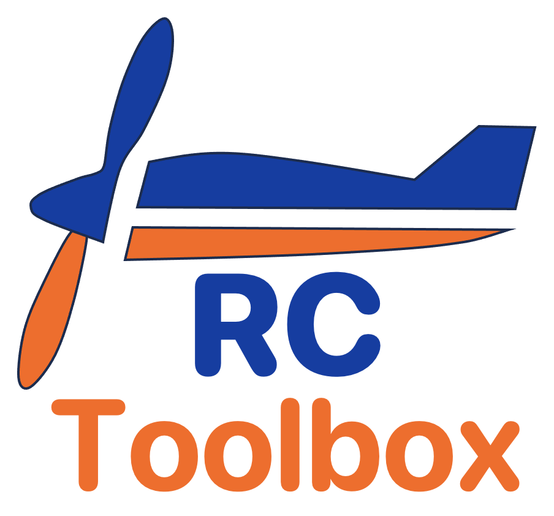
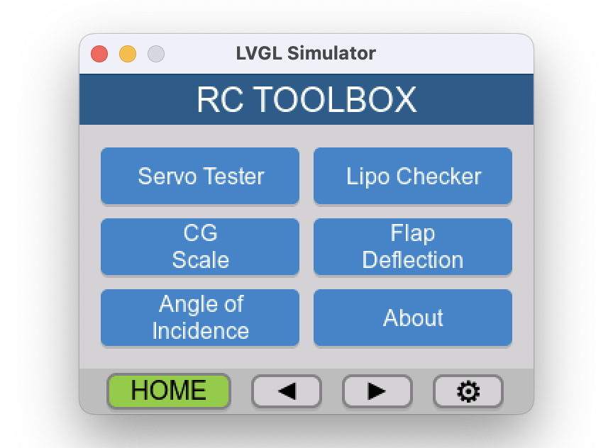
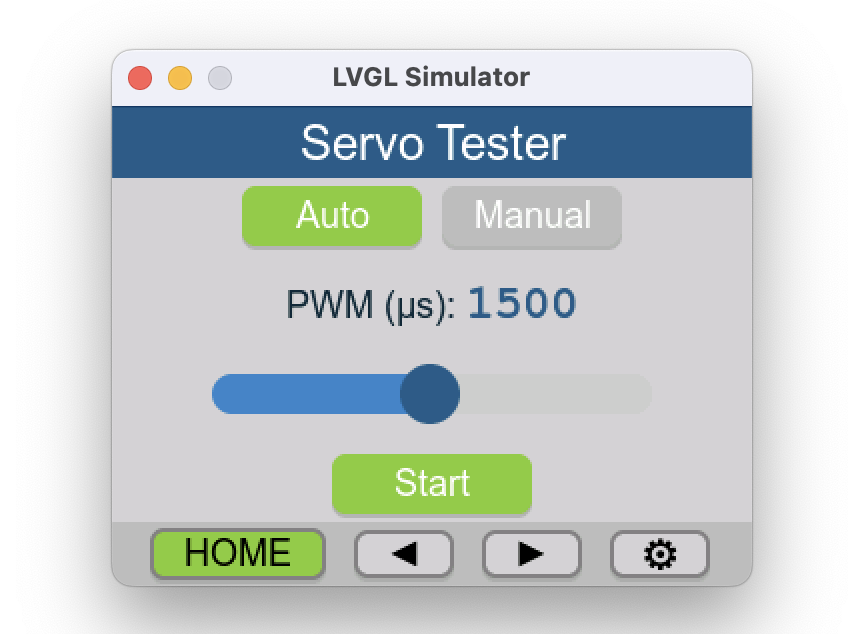
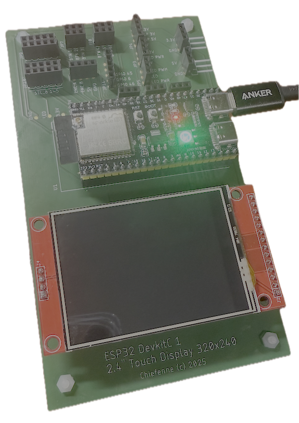

<p align="center">
  
</p>

> **⚠️ Work in Progress**
> This project is currently under active development. Features and documentation may change frequently.

> **Note:** The implementation recently moved to C/C++ with LVGL.

RC TOOLBOX is a suite of software tools tailored for RC enthusiasts. Designed to run on mainly on ESP32 based boards. It provides a versatile platform for enhancing your RC experience.

## Features

### Main Modules
- **Servo Tester** – Test and calibrate servos with manual PWM control or auto-sweep mode
  - Protocol presets: Standard, Extended, Sanwa, Futaba, Digital Fast
  - Customizable PWM range (min/center/max) and frequency (50Hz / 333Hz)
- **Lipo Checker** – Monitor LiPo battery cell voltages for safe charging and storage
- **Battery information** readout and store via NFC tags
- **CG Scale** – Measure center of gravity for precise aircraft balancing
- **Flap Deflection** – Measure control surface deflection angles
- **Angle of Incidence** – Measure wing and stabilizer incidence angles

### User Input
- **Touch screen** – Intuitive touch-based interaction on ILI9341 TFT display
- **EC11 rotary encoder with push button** – Precise value adjustment and menu navigation
- **Tactile buttons** – Quick shortcuts for Home, Back, and Action commands

### User Experience
- **Multi-language support** – English, German, French, Spanish, Italian, Dutch, Czech
- **Persistent settings** – Language, background color, and preferences saved to JSON
- **Customizable UI** – Multiple background color themes (Light Gray, White, Light Blue, Light Green, Cream)
- **Cross-platform development** – macOS simulator for rapid GUI development without hardware

## GUI

The application features a graphical user interface (GUI) built with [LVGL](https://lvgl.io/) for displaying information and controlling the software. The GUI is optimized for **ILI9341 TFT touch displays** (320x240 resolution).

<p align="center">
  <br>
  <em>Splash screen running in the LVGL simulator</em>
</p>

<p align="center">
  <br>
  <em>Home screen running in the LVGL simulator</em>
</p>

<p align="center">
  <br>
  <em>Servo screen running in the LVGL simulator</em>
</p>

## Modules

The toolbox includes the following modules:

| Module | Description |
|--------|-------------|
| **Servo Tester** | Test and calibrate servos with manual PWM control or auto-sweep |
| **Lipo Checker** | Monitor LiPo battery cell voltages |
| **CG Scale** | Measure center of gravity for aircraft balancing |
| **Flap Deflection** | Measure control surface deflection angles |
| **Angle of Incidence** | Measure wing/stabilizer incidence angles |
| **Settings** | Configure language, display brightness, background color |

## Hardware

### Development PCB

A custom PCB has been designed for software development to minimize cable clutter and provide a clean, reliable test platform. The PCB ODB++ files are available for download from [AISLER](https://aisler.net/p/NGHJDVLN). Please note that the PCB functionality has not yet been fully verified. The schematics can be found [here](assets/ESP32_DevkitC-1_TFT_Touch_Display_ILI9341.pdf). Note that this PCB is also used for developing a wireless CNC controller, which explains the naming conventions on the schematic.

<p align="center">
  
  
  <em>Custom development PCB for ESP32-S3 DevKitC-1 and ILI9341 2.4" TFT touch display</em>
</p>

## Credits

This project was inspired by following resources:

- [Servotester_Deluxe by "Der RC-Modellbauer"(Ziege-One)](https://github.com/Ziege-One/Servotester_Deluxe)
- [TheDIYGuy999](https://github.com/TheDIYGuy999/Servotester_Deluxe)
- [shockyfan](https://github.com/shockyfan/Servotester_Deluxe)

Special thanks to the RC modeling community for their invaluable contributions and insights.

## GUI Template for LVGL
- [LVGL Simulator Template](https://github.com/chiefenne/LVGL_Simulator) - GUI template for LVGL with macOS simulator

## Building

### Prerequisites
- **macOS**: Xcode command line tools, SDL2 (`brew install sdl2`)
- **VS Code**: PlatformIO extension for ESP32 development

### macOS Simulator (for rapid GUI development)
```bash
./simulator/build_sim.sh           # Release build
./simulator/build_sim_debug.sh     # Debug build
./binaries/lvgl_simulator_macOS    # Run simulator
```

#### Simulator Keyboard Shortcuts
| Key | Action |
|-----|--------|
| Arrow keys | Encoder rotation (adjust values) |
| Enter | Encoder press (confirm) |
| H | Home button |
| Space | Action button (start/stop) |
| Esc | Back |

### ESP32 (via VS Code + PlatformIO)
Use the PlatformIO sidebar in VS Code:
- **Build**: Click the checkmark icon or `Ctrl+Alt+B`
- **Upload**: Click the arrow icon or `Ctrl+Alt+U`
- **Monitor**: Click the plug icon for serial output

See [LVGL_Simulator](https://github.com/chiefenne/LVGL_Simulator) for detailed LVGL library setup instructions.
