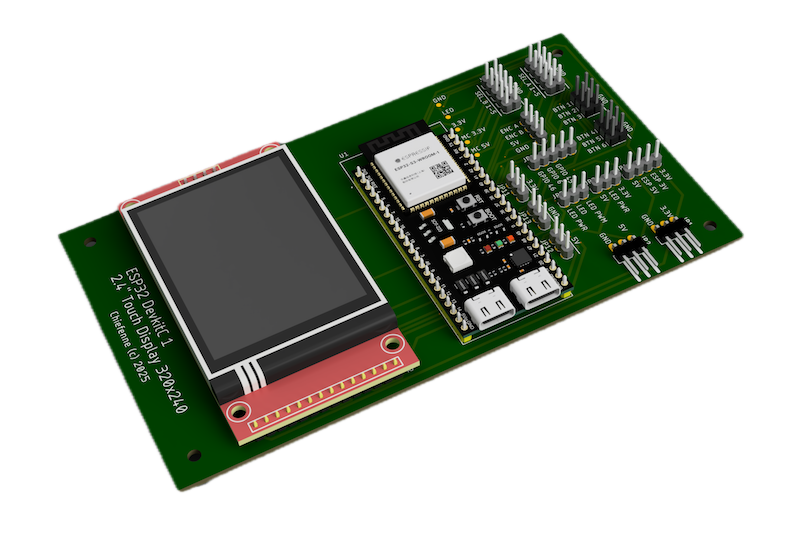

# Hardware

## Components

### Microcontroller

**ESP32-S3 DevKitC-1** (recommended)

- Dual-core Xtensa LX7 @ 240 MHz
- 512 KB SRAM, 8 MB Flash
- USB-C for programming and power
- Built-in RGB NeoPixel LED (GPIO 48)

Other ESP32-S3 boards should work with pin adjustments.

### Display

**2.4" TFT with ILI9341 driver + XPT2046 touch controller**

- Resolution: 320 × 240 pixels (landscape mode)
- SPI interface for both display and touch
- 3.3V logic (compatible with ESP32-S3)

These displays are widely available on AliExpress, Amazon, etc. Look for "2.4 inch TFT SPI ILI9341 touch".

### Rotary Encoder

**EC11 rotary encoder with push button**

- Rotation for value adjustment and menu navigation
- Push button for selection/confirmation
- Active LOW button (internal pull-up used)

### Optional

- **Servo connectors** – Standard 3-pin headers for servo outputs
- **Battery voltage divider** – For LiPo checker function (ADC input)

---

## Pinout

!!! note "Pin configuration files"
    Pin assignments are defined in two places:

    - **`platformio.ini`** – Build flags for TFT_eSPI library (display, touch, SD card, NeoPixel)
    - **`include/pins.h`** – All other pins (servos, encoder, ADC, I2C, backlight)

    If you use different hardware, adjust both files accordingly.

### Display & Touch (SPI)

| Function | GPIO | Notes |
|----------|------|-------|
| TFT_MOSI | 11 | SPI data out |
| TFT_MISO | 13 | SPI data in |
| TFT_SCLK | 12 | SPI clock |
| TFT_CS | 10 | TFT chip select |
| TFT_DC | 8 | Data/Command |
| TFT_RST | 9 | Reset |
| TFT_BL | 5 | Backlight PWM |
| TOUCH_CS | 14 | Touch chip select |
| TOUCH_IRQ | 7 | Touch interrupt |

### Rotary Encoder

| Function | GPIO | Notes |
|----------|------|-------|
| ENC_CLK | 35 | Encoder output A |
| ENC_DT | 36 | Encoder output B |
| ENC_SW | 37 | Push button (active LOW) |

### Servo PWM Outputs

| Servo | GPIO |
|-------|------|
| Servo 1 | 6 |
| Servo 2 | 15 |
| Servo 3 | 16 |
| Servo 4 | 17 |
| Servo 5 | 18 |
| Servo 6 | 21 |

### ADC Inputs (Battery Voltage)

| Channel | GPIO | Notes |
|---------|------|-------|
| ADC 1 | 1 | With voltage divider |
| ADC 2 | 2 | With voltage divider |
| ADC 3 | 3 | With voltage divider |

### Other

| Function | GPIO | Notes |
|----------|------|-------|
| NeoPixel | 48 | Built-in RGB LED |
| SD_CS | 4 | SD card (optional) |
| I2C_SDA | 47 | Future expansion |
| I2C_SCL | 39 | Future expansion (GPIO48 reserved for NeoPixel) |

### NFC (PN532, SPI)

| Function | GPIO | Notes |
|----------|------|-------|
| PN532_SS | 42 | PN532 chip select |
| PN532_IRQ | 41 | Optional data-ready interrupt |
| PN532_RST | 40 | PN532 reset (recommended) |

!!! note "I2C pin choice"
    The ESP32-S3 DevKitC-1 uses GPIO48 for the built-in NeoPixel.
    To avoid conflicts, I2C SCL is assigned to GPIO39 (see `include/pins.h`).

!!! note "Reserved pins / conflicts"
    - SPI bus (shared): GPIO11 (MOSI), GPIO12 (SCLK), GPIO13 (MISO)
    - SPI chip selects (already used): GPIO10 (TFT_CS), GPIO14 (TOUCH_CS), GPIO4 (SD_CS)
    - GPIO48 is reserved for the built-in NeoPixel
    - GPIO45/GPIO46 are available but are strapping-related pins (use with care)
    - Good general-purpose candidates for add-ons (e.g. PN532 SS/IRQ/RST): GPIO38, GPIO40, GPIO41, GPIO42

---

## Wiring Diagram

Connect the display and encoder to the ESP32-S3 according to the pinout table above.

📄 [Download schematic (PDF)](assets/ESP32_DevkitC-1_TFT_Touch_Display_ILI9341.pdf)

---

## Custom PCB

A custom PCB is available for a cleaner build:

