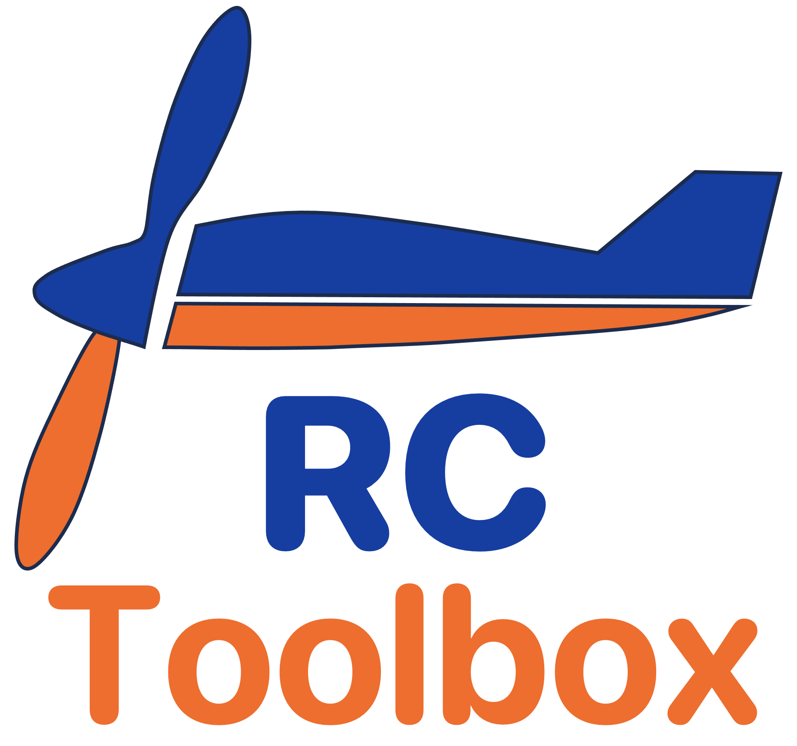
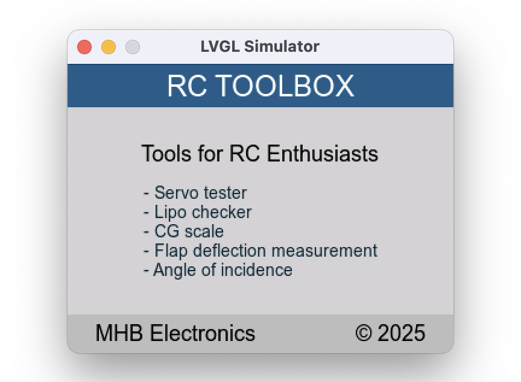
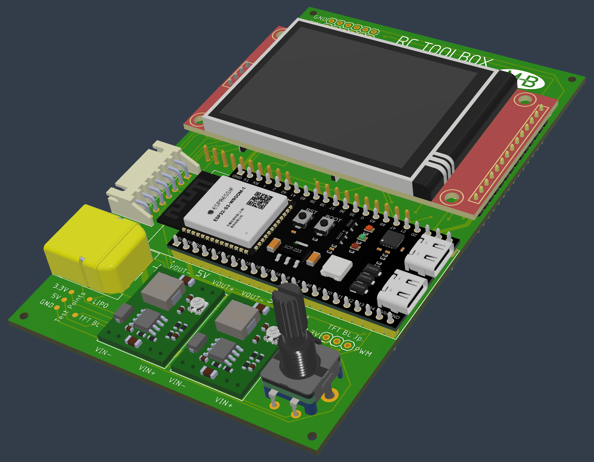
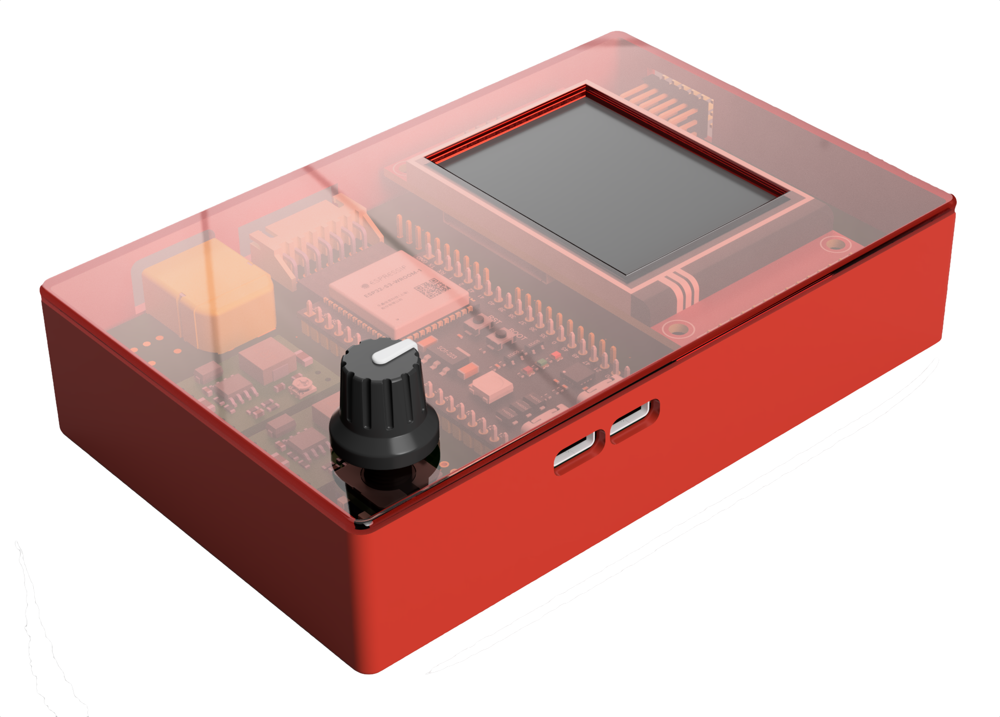
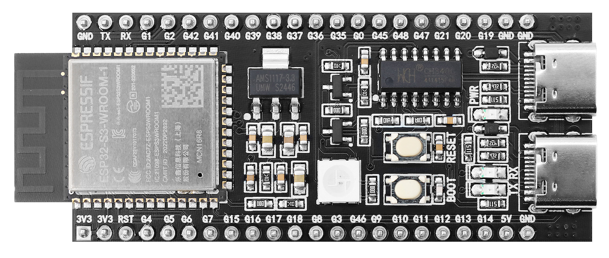
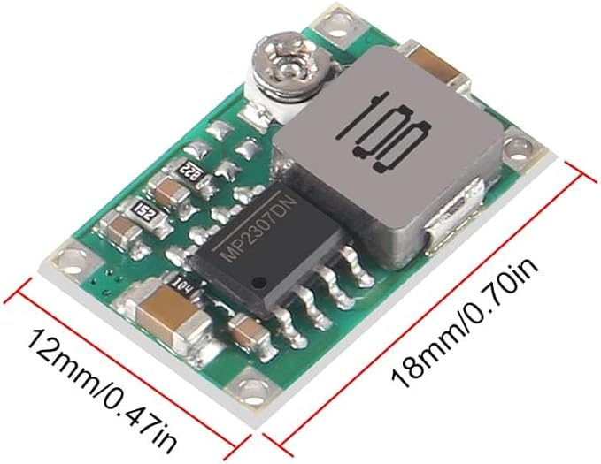
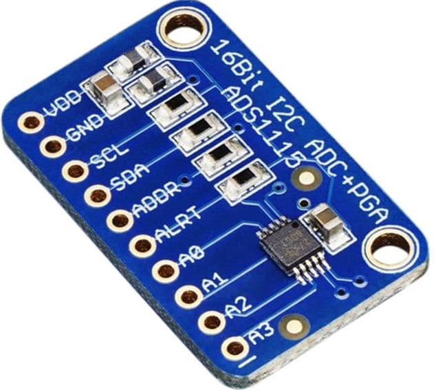
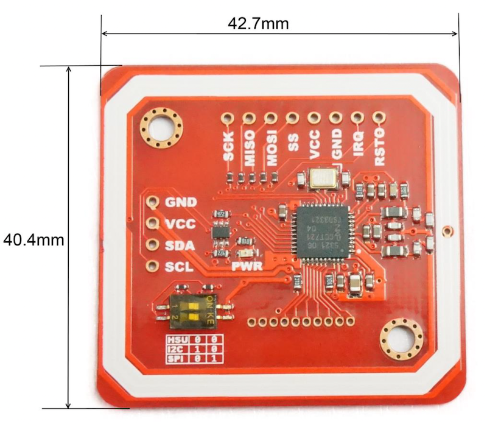

<p align="center">
  
</p>

> **⚠️ Work in Progress**
> This project is currently under active development. Features and documentation may change frequently.

RC TOOLBOX is a suite of software tools tailored for RC enthusiasts. Designed to run on mainly on ESP32 based boards. It provides a versatile platform for enhancing your RC experience.

## Features

### Main Modules

- **Servo Tester** – Test and calibrate up to 6 servos simultaneously
  - Sidebar with individual servo selection (toggle single or long-press for all)
  - Manual PWM control or auto-sweep mode
  - Protocol presets: Standard, Extended, Sanwa, Futaba, Digital Fast
  - Customizable PWM range (min/center/max) and frequency (50Hz / 333Hz)
  - Hardware PWM output on GPIO pins 6, 15, 16, 17, 18, 21
- **Servo Signal Analyzer** – Read and analyze incoming servo/RC signals
  - Measure PWM frequency and pulse width (µs)
  - Track min/max pulse values over time
  - Useful for receiver output testing and servo signal debugging
- **Lipo Checker** – Monitor LiPo battery cell voltages for safe charging and storage
- **Battery information** readout and store via NFC tags
- **CG Scale** – Measure center of gravity for precise aircraft balancing
- **Flap Deflection** – Measure control surface deflection angles
- **Angle of Incidence** – Measure wing and stabilizer incidence angles

### User Input

- **Touch screen** – Intuitive touch-based interaction on ILI9341 TFT display
- **EC11 rotary encoder with push button** – Precise value adjustment and menu navigation

### User Experience

- **Multi-language support** – English, German, French, Spanish, Italian, Dutch, Czech
- **Persistent settings** – Language, background color, and preferences saved to JSON
- **Customizable UI** – Multiple background color themes (Light Gray, White, Light Blue, Light Green, Cream)
- **Cross-platform development** – macOS simulator for rapid GUI development without hardware

## Roadmap

### Core Infrastructure

- ✅ LVGL 9.4 GUI framework with macOS simulator
- ✅ ESP32-S3 hardware integration (TFT, touch, encoder)
- ✅ Persistent settings (JSON on SPIFFS)
- ✅ Multi-language support (7 languages)
- ✅ Custom focus navigation with FocusOrderBuilder
- ✅ NFC card support for tags (batteries, planes)

### Servo Tester

- ✅ Basic PWM output on 6 channels (GPIO 6, 15, 16, 17, 18, 21)
- ✅ Manual mode with encoder control
- ✅ Auto-sweep mode
- ✅ Multi-servo selection (individual toggle, long-press for all)
- ⬜ Protocol presets (Standard, Extended, Sanwa, Futaba, Digital Fast)
- ⬜ Save/load servo profiles
- ✅ Sweep speed adjustment

### Servo Signal Analyzer

- ⬜ Basic page structure
- ⬜ PWM input capture (pulse width measurement)
- ⬜ Frequency detection
- ⬜ Live pulse width display (µs)
- ⬜ Min/max tracking with reset
- ⬜ Signal quality indicator

### Lipo Checker

- ✅ Basic page structure
- ⬜ ADC voltage reading
- ⬜ Cell count detection
- ⬜ Per-cell voltage display
- ⬜ Low voltage warning

### Cellinator – battery tagging

- ⬜ NFC tags per battery
- ⬜ Store and update battery meta data
  - Purchase/installation date
  - Cell type/count
  - Nominal capacity
  - Charge/discharge cycles
  - Min/max cell voltages
  - Internal cell resistance
  - and more ...

### CG Scale

- ✅ Basic page structure
- ⬜ Load cell integration (HX711)
- ⬜ Calibration routine
- ⬜ CG calculation algorithm

### Flap Deflection

- ✅ Basic page structure
- ⬜ IMU integration (MPU6050/ICM20948)
- ⬜ Angle measurement
- ⬜ Reference point calibration

### Angle of Incidence

- ✅ Basic page structure
- ⬜ IMU angle readout
- ⬜ Zero-point calibration
- ⬜ Relative angle display

## GUI

The application features a graphical user interface (GUI) built with [LVGL](https://lvgl.io/) for displaying information and controlling the software. The GUI is optimized for **ILI9341 TFT touch displays** (320x240 resolution).

<p align="center">
  <br>
  <em>Splash screen running in the LVGL simulator</em>
</p>

<p align="center">
  <br>
  <em>Home screen running in the LVGL simulator</em>
</p>

<p align="center">
  <br>
  <em>Servo screen running in the LVGL simulator</em>
</p>

### App navigation

RC TOOLBOX uses a **hub-and-spoke** navigation model optimized for touch and rotary-encoder operation:

- **Home pages (hub):** `PAGE_HOME` is the default landing page. As the project grows, there can be **multiple Home pages** (Home screens) to host additional tool buttons.
- **Tool pages (spokes):** Individual tools (Servo, LiPo, CG Scale, etc.) are entered from the Home pages.

The UI has a consistent **header** (page title) and **footer bar**:

- **Home:** Always returns to the default landing page (`PAGE_HOME`).
- **Prev / Next:** On Home pages, cycles through the available Home screens (wrap-around). On tool pages it is typically unused unless a page defines a custom behavior.
- **Settings:** Opens the settings page.

Tip: A dedicated **Serial Monitor** page is available from the Home screen(s) to show live debug output on the TFT.

## Hardware

### PCB

<p align="center">
  <span>
    
    
  </span>
  <br>
  <em>PCB for the RC TOOLBOX</em>
</p>

<br>

<p align="center">
    <span>
        
    </span>
    <br>
    <em>RC TOOLBOX installed in the enclosure</em>
</p>

<br>

The PCB design sources and manufacturing outputs are stored in the repository under the `hardware/` folder:

- Board layout: `hardware/RC TOOLBOX.fbrd`
- Schematic: `hardware/RC TOOLBOX.fsch`
- Schematic PDF: `hardware/RC TOOLBOX_Schematic_v194.pdf`
- Gerbers: `hardware/RC TOOLBOX_Gerber_v432.zip`

Direct link: <https://github.com/chiefenne/RC_TOOLBOX/tree/main/hardware>

<br>

> **Note:**
> The PCB has not been fully validated. Order based on the supplied Gerbers at your own risk.

> **Note:**
> Some modules (see below) come in different variants (pinouts, and component layouts vary). Before ordering or assembling, verify that your specific module physically fits the PCB footprint and matches the expected connections.

### Modules

The PCB is designed around a small set of off-the-shelf modules.

#### ESP32-S3 DevKitC-1 (Microcontroller)

- **What it does:** Main controller module running the RC TOOLBOX firmware and driving the UI and peripherals.

<p align="center">
  <span>
    
  </span>
  <br>
  <em>ESP32-S3 DevKitC-1</em>
</p>

#### 2.4" TFT touch display (UI)

- **What it does:** Main user interface with capacitive touch input. Uses an **ILI9341 display driver** and **XPT2046 touch controller**.
- **Module style:** One of the common **red Arduino/ESP maker TFT touch displays**.

<p align="center">
  <span>
    
  </span>
  <br>
  <em>2.4" TFT touch display</em>
</p>

#### MP2307-based DC/DC buck modules (Power, x2)

- **What it does:** Converts a **2S/3S LiPo input** to regulated rails.
- **Outputs:** One module provides **3.3V**, one provides **5V**.

<p align="center">
  <span>
    
  </span>
  <br>
  <em>MP2307 based board (e.g., HW133ABC)</em>
</p>

> **Note:**
> If you have problems with these modules, [this video](https://www.youtube.com/watch?v=gQ5fs7hofPk) might help.

#### ADS1115 16-bit ADC modules (LiPo voltage measurement, x2)

- **What it does:** Accurate LiPo voltage readings **up to 6S** using external 16-bit ADCs.
- **Capacity:** With two ADS1115 modules, **2 ADC channels remain free** after the 6S measurement inputs.
- **Resistors:** For best accuracy, use high-accuracy resistors (**1% or better**) with **low thermal drift** in the voltage divider network so the ADS1115 resolution can be fully utilized (see page 2 on the [schematic PDF](https://github.com/chiefenne/RC_TOOLBOX/blob/main/hardware/RC%20TOOLBOX_Schematic_v194.pdf)).

<p align="center">
  <span>
    
  </span>
  <br>
  <em>ADS1115 16-bit ADC</em>
</p>

#### PN532 NFC RFID Module (NFC tagging)

- **What it does:** NFC reader/writer module used for tagging and reading data.

<p align="center">
  <span>
    
  </span>
  <br>
  <em>NFC reader/writer</em>
</p>

> **Note:**
> Only the I2C bus is wired on the PCB

## Building the firmware

### Prerequisites

- **macOS**: Xcode command line tools, SDL2 (`brew install sdl2`)
- **VS Code**: PlatformIO extension for ESP32 development

### macOS Simulator
```bash
./simulator/build_sim.sh
./simulator/build_sim_debug.sh
./binaries/lvgl_simulator_macOS
```

#### Simulator Keyboard Shortcuts
| Key | Action |
|-----|--------|
| Arrow keys | Encoder rotation (adjust values) |
| Enter | Encoder press (confirm) |
| H | Home button |
| Space | Action button (start/stop) |
| Esc | Back |

### ESP32 (via VS Code + PlatformIO)
Use the PlatformIO sidebar in VS Code:
- **Build**: Click the checkmark icon or `Ctrl+Alt+B`
- **Upload**: Click the arrow icon or `Ctrl+Alt+U`
- **Monitor**: Click the plug icon for serial output

See [LVGL_Simulator](https://github.com/chiefenne/LVGL_Simulator) for detailed LVGL library setup instructions.
